# Progopdrachten M5

## Les 1
In deze opdracht worden pilaren gespawned door op het scherm te klikken.

**Script:**  
[Spawner](Assets/Scripts/Spawner.cs)

**Resultaat:**  

Daarnaast spawnen ballen automatisch iedere seconde.

**Script:**  
[Balls](Assets/Scripts/Ballen.cs)

**Resultaat:**  

---

## Les 2
Coin system: een speler (blok) verzamelt coins en de score wordt live bijgewerkt.

**Script:**  
[ScoreSystem](Assets/Scripts/ScoreSystem.cs)

**Resultaat:**  

---

## Les 3
Debugging-opdracht. Document met uitleg en gevonden bugs:

**Document:**  
https://docs.google.com/document/d/1A9Way1L0EpJQ_nYAU97fFFEAygIEalajdR3z9GcCELA/edit?usp=sharing

Bugs gevonden in de Tower Defence game.  
De opdracht “Mythe” ontbreekt.

**Screenshot:**  

---

## Les 4
Alle scripts van de Space Shooter zijn herschreven volgens het Single Responsibility Principle.

**Map:**  
[Scripts](Assets/Scripts/Spaceshooter)

**Resultaat:**  

---

## Les 5
Nog niet uitgevoerd.

---

## Les 6
Dependency analyse.

**Document:**  
https://docs.google.com/document/d/1bXBO7FFVSXiE5CwlVJwobjQiokGVwQ9dZ05z7R6Xghg/edit?usp=sharing

# Progopdrachten M6

## Opdracht  10 Class diagram Towerdefense

```mermaid

classDiagram

class Bullet {
    - int damage
    - float lifeTime
    + Start()
    + OnTriggerEnter2D(collider)
}

class Enemy {
    - int health
    - int cashReward
    - spriteRenderers
    - Transform visuals
    + TakeDamage(dmg)
    + KillEnemy()
    + FlashEffect()
}

Bullet --> Enemy : interacts with


class EnemySpawner {
    - enemyTypes[]
    - baseEnemies
    - enemiesPerSecond
    - maxWaves
    - currentWave
    + SpawnEnemy()
    + EnemyDestroyed()
    + IsAllWavesDone()
}

class EnemyType {
    - GameObject prefab
    - spawnWeight
    - minSpeed
    - maxSpeed
    - weightIncreasePerWave
}

EnemySpawner --> EnemyType : spawns


class Enemymovement {
    - Rigidbody2D rb
    - float moveSpeed
    - int health
    - target
    - PathIndex
    + TakeDamage(dmg)
}

class StraightEnemy {
    - Rigidbody2D rb
    - moveSpeed
    - target
    - pathIndex
    + SetSpeed()
}

class ZigZagEnemy {
    - zigzagAmplitude
    - zigzagFrequency
    - float time
    + SetSpeed()
}

StraightEnemy --> Enemymovement
ZigZagEnemy --> Enemymovement


class Turret {
    - range
    - fireRate
    - bulletPrefab
    - firePoint
    - bulletSpeed
    - turnSpeed
    - target
    + Update()
    + Shoot()
    + EnemyLockOn()
}

Turret --> Bullet : shoots


class PlayerShoot {
    - shootingPoint
    - bulletPrefab
    - bulletSpeed
    - bulletCooldown
    - spreadAngle
    + Shoot(dir)
    + ApplySpread(dir)
    + GetMouseDirection()
}

PlayerShoot --> Bullet : spawns


class PopupSpawner {
    - popupPrefab
    - Transform player
    + SpawnPopup(msg)
}

class PopupText {
    - TMP_Text text
    + Show(msg)
}

PopupSpawner --> PopupText


class ScreenFlash {
    - Image flashImg
    + Flash()
}

class UIManager {
    - Image redPanel
    - popupPrefab
    - playerTransform
    + RedFlash()
    + ShowPopup(text)
    + Fade()
    + Slide()
}


class CashSystem {
    - int cashAmount
    - TMP cashText
    + AddCash()
    + SpendCash()
}


class TurretBuildManager {
    + PlaceTurret(prefab,pos)
}

class TurretDragUI {
    - turretPrefab
    - turretCost
    + OnBeginDrag()
    + OnDrag()
    + OnEndDrag()
}

TurretDragUI --> TurretBuildManager : uses


class SoundManager {
    - sfxSource
    - musicSource
    - clips
    + PlayShoot()
    + PlayPlaceTower()
    + PlayBackgroundMusic()
}


class LevelManager {
    - lives
    - Path[]
    - Healthbar
    - gameOverUI
    + LoseLife()
    + GameOver()
    + RestartLevel()
    + LoadMainMenu()
}


class CamShake {
    + Shake(duration,strength)
}

class CameraDrag {
    - panSpeed
    - bounds
    - useBounds
    + StartDrag()
    + ContinueDrag()
    + EndDrag()
}

class EndlessRunner {
    - vbegin
    - g
    - velocity
    - acceleration
    - State enum
    - t
    - tmax
}

class Shooting {
    - lifetime
}

class Background {
    - Renderer bgBackground
    - speed
}

class SceneSwitcher {
    - nextSceneName
    - spawner
}


	

	

```

